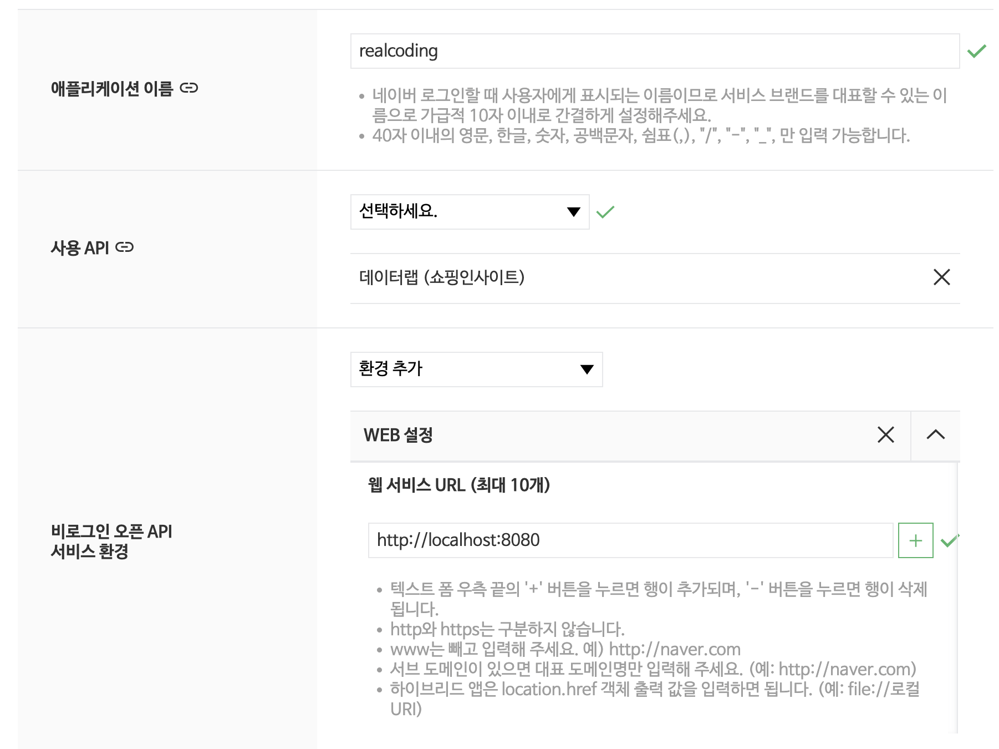

# Step 13: 외부 API 연동
## 네이버 쇼핑 검색 API

**2026 RealCoding**
브랜치: `shop/naver-api`

---

## 외부 API 연동이란?

지금까지: 우리 서버 안에서 데이터 관리
이번 단계: **다른 서비스의 데이터를 가져와서 사용**

```
[브라우저] → [우리 서버 (Spring Boot)] → [네이버 API 서버]
               클라이언트 역할              외부 서비스
```

우리 서버가 **HTTP 클라이언트** 역할을 한다

---

## RestClient - Spring 6.1+ 동기 HTTP 클라이언트

| HTTP 클라이언트 | 도입 시기 | 방식 | 상태 |
|----------------|----------|------|------|
| `RestTemplate` | Spring 3 | 동기 | 유지보수 모드 |
| `WebClient` | Spring 5 | 비동기 | 현역 |
| **`RestClient`** | **Spring 6.1** | **동기** | **권장** |

```java
// RestClient 생성
RestClient restClient = RestClient.builder()
        .baseUrl("https://openapi.naver.com")
        .build();
```

`RestTemplate`의 후속 - 더 간결하고 현대적인 API

---

## 사전 준비: 네이버 API 키 발급 (1/3)

https://developers.naver.com 접속 → 로그인 → **Application** → **애플리케이션 등록**

바로 가기: https://developers.naver.com/apps/#/register

| 항목 | 입력 값 |
|------|---------|
| 애플리케이션 이름 | `realcoding` |
| **사용 API** | **`검색` 선택** ⚠️ 필수! |
| 사용 환경 | `WEB 설정` |
| 웹 서비스 URL | `http://localhost:8080` |

> "사용 API"에서 반드시 **검색**을 선택해야 쇼핑 API 호출이 가능하다.
> 잘못 선택하면 401/403 에러가 발생한다.

---

## 네이버 애플리케이션 등록 화면



https://developers.naver.com/apps/#/register

---

## 사전 준비: 네이버 API 키 발급 (2/3)

등록 완료 후 **내 애플리케이션** → 등록한 앱 클릭 → **개요** 탭

- **Client ID**: 공개 식별자 (예: `abcd1234efgh5678`)
- **Client Secret**: 비밀키 — **보기** 버튼을 눌러야 표시됨

> **⚠️ 보안 주의**
> - Client Secret은 **절대 공개 금지** (GitHub, 블로그, 스크린샷 X)
> - 노출되면 즉시 **재발급** 버튼으로 새 키 발급
> - 호출 한도: **일 25,000회 무료** (실습에 충분)

---

## 사전 준비: API 키 설정 (3/3) - 방법 A: `.env` 파일 (권장)

> **복습:** Step 8에서 배운 `.env` 파일 패턴을 사용한다.

**1단계:** `application.properties`에 이미 아래 설정이 있다.
```properties
spring.config.import=optional:file:.env[.properties]
```

**2단계:** `.env.example`을 복사해서 `.env` 생성
```bash
cp .env.example .env             # macOS / Linux / Git Bash
copy .env.example .env            # Windows (cmd)
```

**3단계:** `.env` 파일을 열어 발급받은 값을 입력
```properties
# .env
naver.client-id=발급받은_Client_ID
naver.client-secret=발급받은_Client_Secret
```

**4단계:** 실행 → 끝!
```bash
./gradlew bootRun         # gradlew.bat bootRun (Windows)
```

> `.env`는 `.gitignore`에 등록되어 있어 **절대 Git에 커밋되지 않는다**.

---

## 사전 준비: API 키 설정 (3/3) - 방법 B: OS 환경변수

`.env` 파일 대신 OS 환경변수로 설정할 수도 있다. (CI/CD, 서버 배포 시 유용)

```bash
# macOS / Linux
export NAVER_CLIENT_ID=발급받은_ID
export NAVER_CLIENT_SECRET=발급받은_Secret
```

```cmd
:: Windows (cmd)
set NAVER_CLIENT_ID=발급받은_ID
set NAVER_CLIENT_SECRET=발급받은_Secret
```

```powershell
# Windows (PowerShell)
$env:NAVER_CLIENT_ID="발급받은_ID"
$env:NAVER_CLIENT_SECRET="발급받은_Secret"
```

**IntelliJ 사용자:** `Run` → `Edit Configurations...` → **Environment variables** 필드에 등록

> **우선순위:** `.env` < OS 환경변수 (둘 다 있으면 OS 환경변수가 이김)

---

## 네이버 쇼핑 검색 API

**엔드포인트**: `GET https://openapi.naver.com/v1/search/shop.json`

요청:
```
GET /v1/search/shop.json?query=맥북&display=10
Headers:
  X-Naver-Client-Id: {Client ID}
  X-Naver-Client-Secret: {Client Secret}
```

응답:
```json
{
  "total": 12345,
  "display": 10,
  "items": [
    { "title": "맥북 프로", "lprice": "2390000", "brand": "Apple" }
  ]
}
```

---

## DTO 정의 (record)

```java
// 전체 응답 구조
public record NaverShoppingResponse(
    String lastBuildDate,
    int total,
    int start,
    int display,
    List<ShoppingItem> items
) { }

// 개별 상품 정보
public record ShoppingItem(
    String title,       // 상품명
    String link,        // 상품 URL
    String image,       // 이미지 URL
    String lprice,      // 최저가
    String hprice,      // 최고가
    String mallName,    // 쇼핑몰
    Long productId,     // 상품 ID
    String brand,       // 브랜드
    String maker        // 제조사
    // ...
) { }
```

**JSON 필드명 = record 필드명 -> 자동 매핑**

---

## NaverShoppingService 구현

```java
@Service
public class NaverShoppingService {

    private final RestClient restClient;

    @Value("${naver.client-id}")       // 설정 파일에서 주입
    private String clientId;

    @Value("${naver.client-secret}")
    private String clientSecret;

    public NaverShoppingService() {
        this.restClient = RestClient.builder()
                .baseUrl("https://openapi.naver.com")
                .build();
    }
    // ...
}
```

---

## RestClient 호출 흐름

```java
public List<ShoppingItem> searchProducts(String query, int display) {

    NaverShoppingResponse response = restClient.get()   // 1. GET 메서드
        .uri(uriBuilder -> uriBuilder                    // 2. URL 구성
            .path("/v1/search/shop.json")
            .queryParam("query", query)
            .queryParam("display", display)
            .build())
        .header("X-Naver-Client-Id", clientId)           // 3. 인증 헤더
        .header("X-Naver-Client-Secret", clientSecret)
        .retrieve()                                       // 4. 요청 실행
        .body(NaverShoppingResponse.class);               // 5. JSON → 객체

    return response.items();
}
```

**메서드 체이닝(Method Chaining)**: 각 메서드가 자기 자신을 반환하여 `.`으로 연결하는 패턴. 마치 문장을 읽듯이 코드를 작성할 수 있다.

---

## ShoppingController

```java
@RestController
@RequestMapping("/shop")
public class ShoppingController {

    private final NaverShoppingService naverShoppingService;

    public ShoppingController(NaverShoppingService naverShoppingService) {
        this.naverShoppingService = naverShoppingService;
    }

    // GET /shop/search?query=맥북&display=10
    @GetMapping("/search")
    public List<ShoppingItem> searchProducts(
            @RequestParam String query,
            @RequestParam(defaultValue = "10") int display) {
        return naverShoppingService.searchProducts(query, display);
    }
}
```

---

## @Value + 환경변수 폴백

```properties
# application.properties
naver.client-id=${NAVER_CLIENT_ID:your-client-id}
naver.client-secret=${NAVER_CLIENT_SECRET:your-client-secret}
```

```
${NAVER_CLIENT_ID:your-client-id}
  ↓
환경변수 NAVER_CLIENT_ID가 있으면 → 그 값 사용
없으면 → "your-client-id" (기본값) 사용
```

> **주의:** API 키를 소스코드에 직접 입력하면 안 된다! 반드시 환경변수나 설정 파일을 사용하자.

- 코드에 넣으면 → Git에 노출될 위험
- 환경변수로 관리 → 안전

---

## 전체 호출 흐름

```
[Client]
  ↓  GET /shop/search?query=맥북
[ShoppingController]
  ↓  naverShoppingService.searchProducts("맥북", 10)
[NaverShoppingService]
  ↓  RestClient → 네이버 API 서버
[네이버 API 서버]
  ↓  JSON 응답
[NaverShoppingService]
  ↓  NaverShoppingResponse → List<ShoppingItem>
[ShoppingController]
  ↓  JSON 응답
[Client]
```

계층 구조 유지: Controller -> Service -> 외부 API

---

## 실습 (practice 브랜치)

```bash
git checkout shop/naver-api-practice
```

**사전 준비:** https://developers.naver.com 에서 API 키 발급

**과제:**
1. `NaverShoppingResponse`, `ShoppingItem` DTO 작성
2. `NaverShoppingService` 구현 (RestClient + @Value)
3. `ShoppingController` 구현 (GET /shop/search)
4. `application.properties`에 API 키 설정

**테스트:**
```bash
# macOS / Linux
export NAVER_CLIENT_ID=발급받은_ID
export NAVER_CLIENT_SECRET=발급받은_Secret

# Windows (cmd)
set NAVER_CLIENT_ID=발급받은_ID
set NAVER_CLIENT_SECRET=발급받은_Secret

# Windows (PowerShell)
$env:NAVER_CLIENT_ID="발급받은_ID"
$env:NAVER_CLIENT_SECRET="발급받은_Secret"

./gradlew bootRun
# Windows: gradlew.bat bootRun

# (Windows에서는 Git Bash 또는 PowerShell에서 실행)
curl "http://localhost:8080/shop/search?query=맥북&display=5"
```

---

## 핵심 정리

> **RestClient로 외부 API를 호출하고, JSON 응답을 DTO로 변환한다.
> API 키는 @Value + 환경변수 폴백으로 안전하게 관리한다.**

**기억할 키워드:**
- `RestClient` - Spring 6.1+ 동기 HTTP 클라이언트
- `.retrieve().body(Class)` - JSON 자동 변환
- `@Value("${key}")` - 설정 값 주입
- `${ENV_VAR:default}` - 환경변수 폴백 패턴
